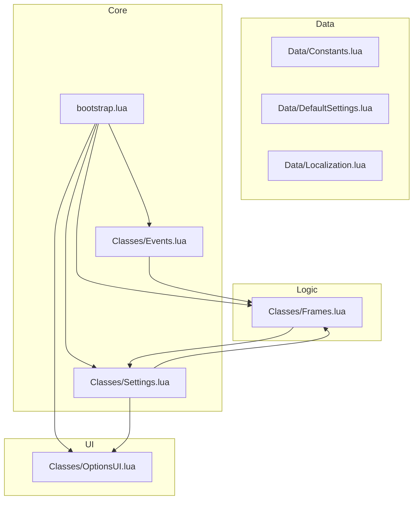
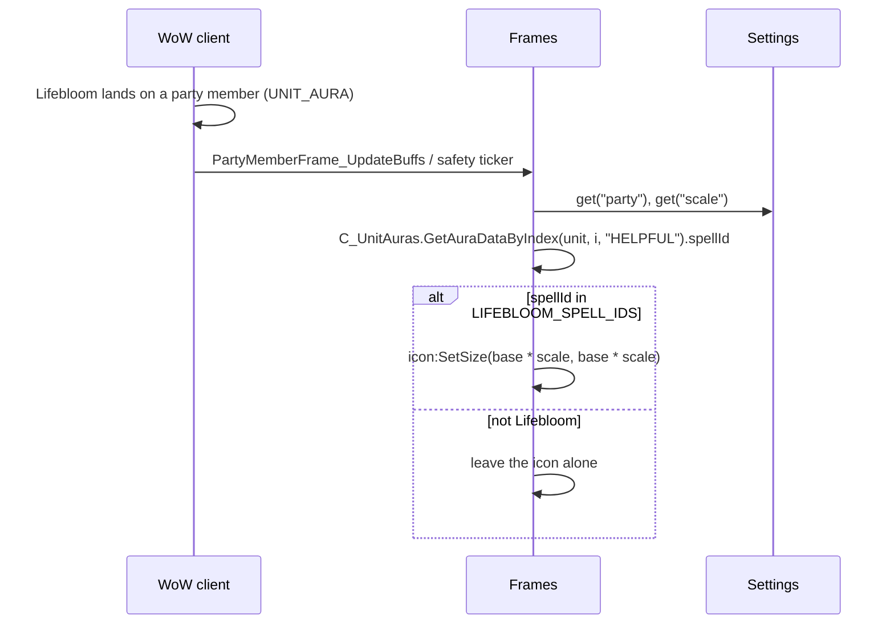

# BloomBuddy Architecture

This document describes the architecture of the **BloomBuddy** addon (v0.1) — enlarging the **Lifebloom** buff icon on party and raid frames (TBC Anniversary, Interface `20506`).

---

## 1. Principles

1. **Minimality.** The addon does exactly one thing: resize the Lifebloom icon on unit frames. No bloat, no frameworks.
2. **Modularity.** Each module is a separate file-table. A module knows nothing about the internals of other modules — only their public API.
3. **One global object.** `BB` is the addon's only global table. Inside — nested modules: `BB.Events`, `BB.Settings`, `BB.Frames`, `BB.OptionsUI`, `BB.Data.*`, `BB.Utils.*`.
4. **Event-driven.** Inter-module communication goes through the internal event bus (`BB.Events:fire`). Game events are registered on the addon's frame.
5. **No libraries.** Vanilla WoW API only (the addon must work without external dependencies).
6. **Testability.** The non-UI parts (Settings, Events, bootstrap) are written so unit tests can run in a sandbox (see `Tests/`, planned).
7. **Gameplay safety.** The addon only reads frames/auras and calls `SetSize` on a texture. It never moves, hides, or re-parents anything and never affects other addons.

---

## 2. Module overview



### 2.1 `bootstrap.lua` — entry point

- Creates the global `BB` table (`_G.BB`).
- Creates an invisible event frame `BB.Frame` (`CreateFrame("Frame")`).
- Subscribes to `ADDON_LOADED` and initializes modules in strict order:
  1. `BB.Data.*` (already loaded via TOC)
  2. `BB.Events:_init(BB.Frame)`
  3. `BB.Settings:_init()` — reads `BloomBuddyDB`
  4. `BB.Frames:_init()` — hooks + safety ticker
  5. `BB.OptionsUI:_init()` — slash commands
- Right after initialization it runs an initial re-check (`Frames:checkNow()`), to catch the case where the addon loads mid-combat or mid-group (e.g. `/reload`).

### 2.2 `Classes/Events.lua` — event bus

A simplified version of the pattern proven in the sibling addon ArenaChillPrep:

```lua
BB.Events:register(identifier, event, callback)
BB.Events:unregister(identifier, event)
BB.Events:fire(event, ...)
```

- The frame's `OnEvent` dispatches raw game events to subscribers.
- `fire` is used by modules for internal events (prefixed `BB_`).
- Lets modules unsubscribe without knowing about other subscribers.

### 2.3 `Classes/Settings.lua` and `Data/DefaultSettings.lua`

- `BloomBuddyDB` — SavedVariables (see `.github/CONTEXT.md`).
- `Settings:get(path)` / `Settings:set(path, value)` — access by dot path (`"scale"`, `"party"`).
- On load — deep merge of defaults and saved data (robust against new settings added in future versions) + `ensureDefaults` migration.

### 2.4 `Classes/Frames.lua` — core (Lifebloom detection + scaling)

The only module that knows about unit frames. Answers one question per buff icon: **"is this Lifebloom, and should it be enlarged?"** — and if yes, resizes it.

```lua
BB.Frames:isLifebloomAura(unit, index) -> boolean   -- spellID match via C_UnitAuras
BB.Frames:applyToBuffButton(unit, buffFrame, index) -- resize one buff icon
BB.Frames:applyToParty() -> count                   -- party frames
BB.Frames:onCompactUnitFrameUpdateBuff(unitButton, index, numBuffs, isDebuff)  -- raid hook
BB.Frames:apply() -> count                          -- re-apply everywhere (safety net)
BB.Frames:checkNow()                                -- forced re-apply (bootstrap / /bb status)
```

**Detection** (verified API on 2.5.5 — see `wow-api-20506` skill):

```lua
local aura = C_UnitAuras.GetAuraDataByIndex(unit, index, "HELPFUL");
if (aura and aura.spellId) then
    for _, id in ipairs(BB.Data.Constants.LIFEBLOOM_SPELL_IDS) do
        if (aura.spellId == id) then return true; end
    end
end
```

**Scaling:**

```lua
-- Store the ORIGINAL size once (never compound the scale).
local base = icon._bbBaseSize or (icon:GetWidth() or 16);
icon._bbBaseSize = base;
icon:SetSize(math.max(1, math.floor(base * scale)), math.max(1, math.floor(base * scale)));
```

**Party frames.** Iterates `PartyMemberFrame1..4`; for each member's buff container
(`<frame>.BuffFrame.Buff<1..N>` — **verify paths/count on 2.5.x**) it checks the
corresponding aura index and resizes a matching icon.

**Raid frames.** Hooks the stable global `CompactUnitFrame_UpdateBuff` (SecureHook,
with a manual wrapper fallback if `SecureHook` is unavailable). The handler looks up
`C_UnitAuras.GetAuraDataByIndex(unitButton.unit, index, isDebuff and "HARMFUL" or "HELPFUL")`
and resizes the icon when the spellID matches. This runs right after Blizzard draws each
buff, so the scale survives the client's own redraw.

**Safety net.** A periodic ticker (`RECHECK_TICK = 0.5 s`, via `BB.Utils.Timers`) re-runs
`apply()` while the addon is enabled, covering buffs drawn through code paths the hooks
don't intercept (e.g. party frames when only the raid hook is installed).

### 2.5 `Classes/OptionsUI.lua` — slash commands + status

- `/bb` — prints status (`enabled`, `scale`, `party`, `raid`) and re-applies now (returns the scaled-icon count).
- `/bb enable` / `/bb disable` — writes `enabled` through `BB.Settings`.
- `/bb debug` — toggles `BB.debug` (verbose logging).
- `/bb help` — command list.
- A full **Interface Options panel** (master switch, scale slider, party/raid checkboxes) is a later phase (Phase 3 of the development plan). All strings go through `BB.L`.

### 2.6 `Utils/Tables.lua`, `Utils/Timers.lua`

- `Tables:deepMerge` / `Tables:shallowCopy` — used by `Settings:_init`.
- `Timers:after/interval/cancel` — named timers over `C_Timer`. **Important:** on this client a `C_Timer` handle's `Cancel()` is unreliable, so each named entry carries an `active` flag and the callback bails unless the entry is still the one registered under its name (verified live in ArenaChillPrep). Never use raw `C_Timer` handles.

### 2.7 `Data/Constants.lua`, `Data/Localization.lua`

- `Constants`: `LIFEBLOOM_SPELL_IDS` (`33763`/`48450`/`48451` — **verify**), `LIFEBLOOM_TEXTURE` (`Interface\Icons\Spell_Nature_LifeBloom` — **verify**), `DEFAULT_SCALE`, `MAX_PARTY_BUFFS`, `MAX_RAID_BUFFS`, `RECHECK_TICK`.
- `Localization`: `L` table with a metatable fallback to the key (enUS + ruRU).

---

## 3. End-to-end data flow (v0.1)



The raid path is identical but driven by the `CompactUnitFrame_UpdateBuff` hook (fires per
buff, per redraw) instead of the ticker.

---

## 4. Edge cases

| Situation | Behavior |
|---|---|
| Addon loads mid-group (`/reload` in a raid) | `checkNow()` at init re-applies the scale immediately |
| Blizzard redraws the icons (new buff, buff fade) | The hook re-applies after each draw; the ticker covers the rest |
| Member has Lifebloom R2/R3 instead of R1 | Matched by the full spellID list |
| Multiple members with Lifebloom | Every matching icon is resized independently |
| Addon disabled | `apply()` returns 0 immediately — no scanning, no scaling |
| `party` or `raid` toggle off | The corresponding scan/hook is skipped |
| Icon already resized | `_bbBaseSize` (stored once) prevents compounding the scale |
| Aura object missing for an index | Detection falls back to the texture comparison |
| `SecureHook` unavailable | Manual global wrapper fallback (`orig(...)` then handler) |
| Icon frame path differs on 2.5.x | Defensive `and`-chains + the ticker; paths are verified in Phase 1/2 |
| Scale setting invalid (e.g. `0`) | Clamped with `math.max(1, ...)` |

---

## 5. Key decisions (ADR style)

1. **No Ace libraries.** The addon is tiny; vanilla API suffices. We write our own minimal event frame and timers.
2. **Detection by spellID, not by name.** `GetSpellInfo` localization differences are avoided; the C_UnitAuras object API is verified on this client (the legacy `UnitBuff`/`UnitAura` are broken).
3. **Hook + ticker, not one-time SetSize.** Blizzard resets icon sizes on every redraw — the hook is the primary re-apply, the ticker is the safety net. This mirrors how proven frame addons behave on the same client.
4. **Match the full rank list.** Lifebloom R1/R2/R3 are distinct spellIDs; matching all three avoids missing icons.
5. **Settings via dot paths.** `Settings:get("scale")` — trivial to extend (e.g. a future per-frame scale).
6. **Port ArenaChillPrep's infrastructure, not its features.** The `BB` vararg chain, `Events`/`Settings`/`Timers`/`Tables` modules, `.github/` tooling and test conventions are a lean port from the sibling addon (same client) — keep them consistent.

---

## 5b. Unit tests (see `Tests/` — planned)

Not yet created (Phase 3 of the development plan). When added, the suite will mirror the
ArenaChillPrep harness: `Tests/` runs **outside the game** under LuaJIT (luaunit + luacov +
WoW stubs), target ≥ 90% coverage of non-UI modules. `Classes/Frames.lua` and
`Classes/OptionsUI.lua` are UI-heavy and expected to be excluded or lightly covered.
Read the `unit-testing` skill before writing tests.

---

## 6. Future expansion (not in v0.1)

- **v0.2:** full Interface Options panel (scale slider, per-frame toggles, localized).
- **v0.2:** support other heal-over-time spells (Rejuvenation, Regrowth) via a configurable list.
- **v1.0:** CurseForge/Wago release, optional in-combat re-check, performance tuning (only scan visible frames).
