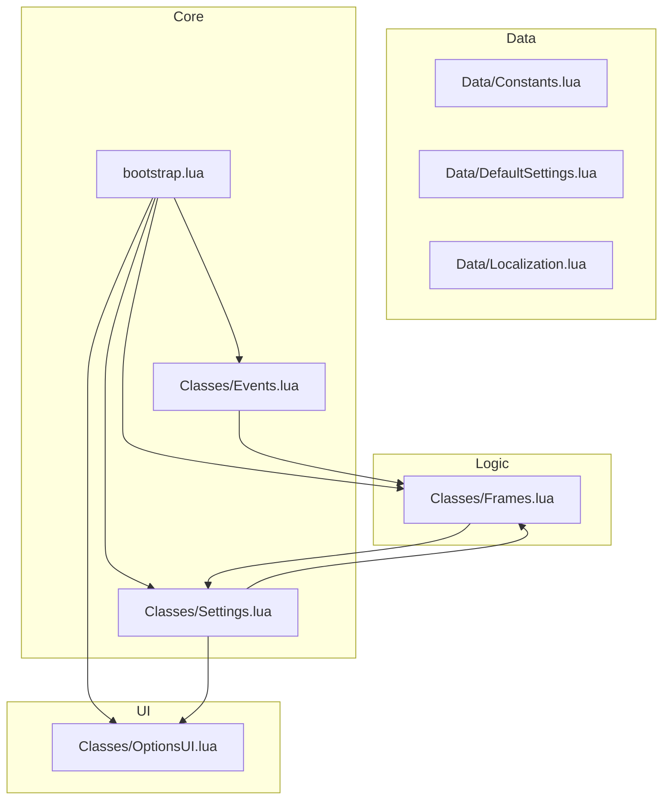
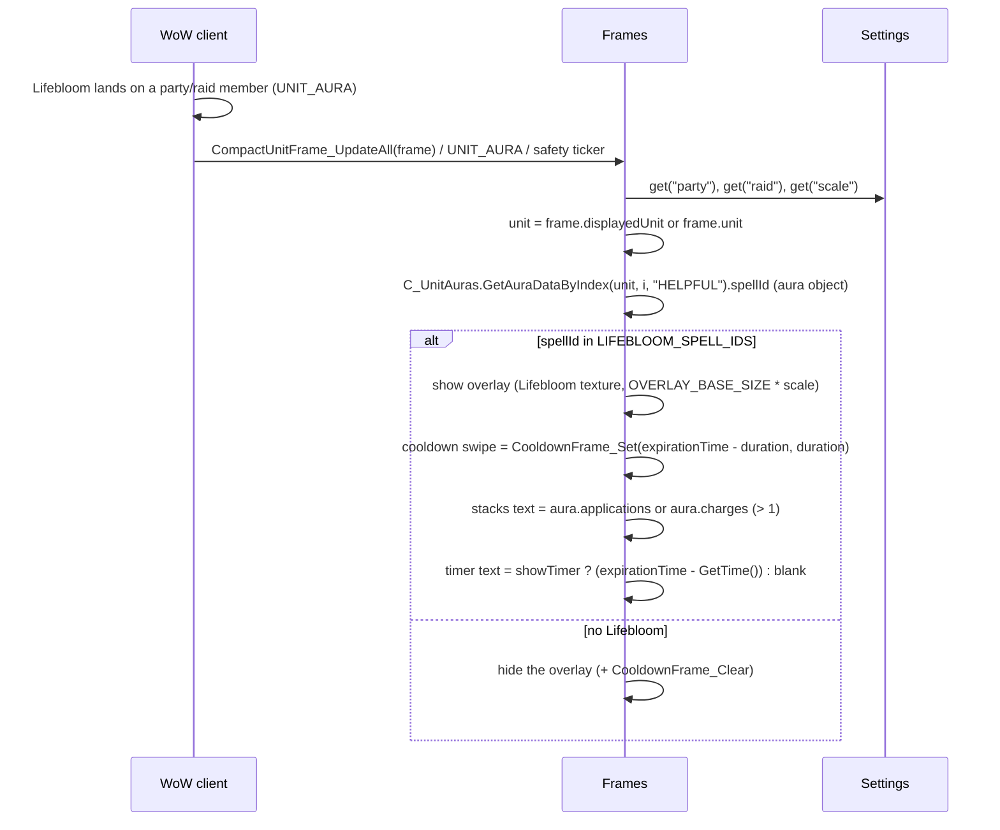

# BloomBuddy Architecture

This document describes the architecture of the **BloomBuddy** addon (v0.1) — enlarging the **Lifebloom** buff icon on party and raid frames (TBC Anniversary, Interface `20506`).

---

## 1. Principles

1. **Minimality.** The addon does exactly one thing: resize the Lifebloom icon on unit frames. No bloat, no frameworks.
2. **Modularity.** Each module is a separate file-table. A module knows nothing about the internals of other modules — only their public API.
3. **One global object.** `BB` is the addon's only global table. Inside — nested modules: `BB.Events`, `BB.Settings`, `BB.Frames`, `BB.OptionsUI`, `BB.Data.*`, `BB.Utils.*`.
4. **Event-driven.** Inter-module communication goes through the internal event bus (`BB.Events:fire`). Game events are registered on the addon's frame.
5. **No libraries.** Vanilla WoW API only (the addon must work without external dependencies).
6. **Testability.** The non-UI parts (Settings, Events, bootstrap) are written so unit tests can run in a sandbox (see `Tests/`, planned).
7. **Gameplay safety.** The addon only reads frames/auras and calls `SetSize` on a texture. It never moves, hides, or re-parents anything and never affects other addons.

---

## 2. Module overview



### 2.1 `bootstrap.lua` — entry point

- Creates the global `BB` table (`_G.BB`).
- Creates an invisible event frame `BB.Frame` (`CreateFrame("Frame")`).
- Subscribes to `ADDON_LOADED` and initializes modules in strict order:
  1. `BB.Data.*` (already loaded via TOC)
  2. `BB.Events:_init(BB.Frame)`
  3. `BB.Settings:_init()` — reads `BloomBuddyDB`
  4. `BB.Frames:_init()` — hooks + safety ticker
  5. `BB.OptionsUI:_init()` — slash commands
- Right after initialization it runs an initial re-check (`Frames:checkNow()`), to catch the case where the addon loads mid-combat or mid-group (e.g. `/reload`).

### 2.2 `Classes/Events.lua` — event bus

A simplified version of the pattern proven in the sibling addon ArenaChillPrep:

```lua
BB.Events:register(identifier, event, callback)
BB.Events:unregister(identifier, event)
BB.Events:fire(event, ...)
```

- The frame's `OnEvent` dispatches raw game events to subscribers.
- `fire` is used by modules for internal events (prefixed `BB_`).
- Lets modules unsubscribe without knowing about other subscribers.

### 2.3 `Classes/Settings.lua` and `Data/DefaultSettings.lua`

- `BloomBuddyDB` — SavedVariables (see `.github/CONTEXT.md`).
- `Settings:get(path)` / `Settings:set(path, value)` — access by dot path (`"scale"`, `"party"`).
- On load — deep merge of defaults and saved data (robust against new settings added in future versions) + `ensureDefaults` migration.

### 2.4 `Classes/Frames.lua` — core (Lifebloom detection + overlay)

The only module that knows about unit frames. Answers one question per compact frame: **"does this member have Lifebloom?"** — and if yes, shows an enlarged Lifebloom overlay icon on their frame.

> **Design note (client-verified, 2026-08):** on TBC Anniversary 2.5.6 the native buff icons on compact frames (raid + raid-style party) are **C-rendered** — there is no Lua-accessible per-buff icon to `SetSize` and no per-buff hide filter. `frame.auraSize` would enlarge ALL buffs+debuffs of a member uniformly, so it is NOT used. The proven pattern on this client (SweepyBoop, BigDebuffs) is a custom overlay icon.

```lua
BB.Frames:getLifebloomAura(unit) -> aura|nil           -- scan HELPFUL auras by spellID, return the aura object
BB.Frames:isLifebloomAura(unit) -> boolean             -- wrapper: getLifebloomAura(unit) ~= nil
BB.Frames:onCompactUnitFrameUpdateAll(frame)           -- hook handler: track frame + refresh overlay
BB.Frames:apply() -> count                             -- refresh all tracked frames (safety net)
BB.Frames:checkNow()                                   -- forced re-apply (bootstrap / /bb status)
BB.Frames:ensureTicker() / stopTicker()                -- enabled <-> ticker lifecycle
```

**Detection** (verified on 2.5.x; stack count is `.applications` on this client — BigDebuffs, BetterBlizzFrames, ArenaAnalytics):

```lua
for i = 1, MAX_AURA_SCAN do
    local aura = C_UnitAuras and C_UnitAuras.GetAuraDataByIndex(unit, i, "HELPFUL");
    if (not aura) then break end
    for _, id in ipairs(BB.Data.Constants.LIFEBLOOM_SPELL_IDS) do
        if (aura.spellId == id) then return aura end   -- aura carries .applications, .expirationTime, .duration
    end
end
```

**Frame tracking.** Hooks the global `CompactUnitFrame_UpdateAll` (SecureHook, with a manual
wrapper fallback). Each call registers the frame in `self._frames` (frame → true) and refreshes
its overlay. Frames are pooled/reused by the client, so the set is kept for the session; forbidden
or hidden frames skip their overlay.

**Overlay.** One child frame per tracked compact frame (created lazily, cached on
`frame.BB_LifebloomOverlay`): a texture showing the Lifebloom icon, sized
`OVERLAY_BASE_SIZE * scale` and anchored at `OVERLAY_ANCHOR` (top-right of the member frame —
user feedback 2026-08-15: the native buff/debuff strip runs along the bottom, so a right-edge
icon got its lower part covered by debuffs; the upper-right area is clear). Shown while the
member has Lifebloom, hidden otherwise.
It carries three children:
- `overlay.cooldown` — a native **`Cooldown` widget** (SetAllPoints), created with the
  **`"CooldownFrameTemplate"`** (required on this client for the swipe texture — every working addon
  uses it; a bare `CreateFrame("Cooldown")` has no swipe texture). Driven with
  `CooldownFrame_Set(cooldown, expirationTime - duration, duration, true)` when `duration > 0`
  (else `CooldownFrame_Clear`). Configured `SetAlpha(1)`, `SetSwipeColor(0,0,0,0.7)` (plain darkening sweep),
  `SetDrawEdge(false)`, `SetDrawBling(false)`, **`SetReverse(true)`** (client-correct sweep direction),
  `SetHideCountdownNumbers(true)`, and
  `noCooldownCount = true` (opt-out for countdown add-ons like OmniCC — without it they draw
  their own numbers on the widget that the addon cannot hide). The client
  animates the clockwise darkening itself — the re-`Set` on each refresh just keeps it in sync
  when Lifebloom is re-applied. The overlay is `Show()`n **before** driving the cooldown so the
  C-side sweep initializes while visible.
- `overlay.stacks` — the stack count (`aura.applications or aura.charges`, hidden at ≤ 1),
  bottom-right of the icon;
- `overlay.timer` — the remaining time (`aura.expirationTime - GetTime()`, "N" under 60 s and
  "m:ss" above), bottom-center of the icon. **Shown only when `showTimer` is on** (`/bb timer`;
  default off — the swipe is the default remaining-time display).

All three are refreshed by every `updateFrame` call (the 0.5 s ticker already re-runs `apply()`
while enabled, so the optional digital countdown updates without an extra timer).

**Refresh triggers.** (1) the `CompactUnitFrame_UpdateAll` hook (frame setup/reuse), (2) the
`UNIT_AURA` / `GROUP_ROSTER_UPDATE` events (aura changes / group changes), (3) a periodic safety
ticker (`RECHECK_TICK = 0.5 s`, via `BB.Utils.Timers`) that re-runs `apply()` while the addon is
enabled — covers cases the hook/events miss.

**Frame-name → setting mapping.** Frame names starting with `CompactPartyFrame` are gated by the
`party` setting; `CompactRaid*` by `raid`.

### 2.5 `Classes/OptionsUI.lua` — slash commands + status

- `/bb` — prints status (`enabled`, `scale`, `party`, `raid`, `timer`) and re-applies now (returns the scaled-icon count).
- `/bb enable` / `/bb disable` — writes `enabled` through `BB.Settings`.
- `/bb timer` — toggles `showTimer` (digital countdown on the overlay; default off).
- `/bb debug` — toggles `BB.debug` (verbose logging).
- `/bb help` — command list.
- A full **Interface Options panel** (master switch, scale slider, party/raid checkboxes) is a later phase (Phase 3 of the development plan). All strings go through `BB.L`.

### 2.6 `Utils/Tables.lua`, `Utils/Timers.lua`

- `Tables:deepMerge` / `Tables:shallowCopy` — used by `Settings:_init`.
- `Timers:after/interval/cancel` — named timers over `C_Timer`. **Important:** on this client a `C_Timer` handle's `Cancel()` is unreliable, so each named entry carries an `active` flag and the callback bails unless the entry is still the one registered under its name (verified live in ArenaChillPrep). Never use raw `C_Timer` handles.

### 2.7 `Data/Constants.lua`, `Data/Localization.lua`

- `Constants`: `LIFEBLOOM_SPELL_IDS` (`33763`/`48450`/`48451` — `33763` verified in game), `LIFEBLOOM_TEXTURE` (`Interface\Icons\Spell_Nature_LifeBloom` — **verify**), `DEFAULT_SCALE`, `MAX_AURA_SCAN`, `OVERLAY_BASE_SIZE`, `OVERLAY_ANCHOR`, `RECHECK_TICK`, feature flags `SHOW_TIMER`/`SHOW_STACKS` + the timer/stacks font sizes & anchors.
- `Localization`: `L` table with a metatable fallback to the key (enUS + ruRU).

---

## 3. End-to-end data flow (v0.1)



---

## 4. Edge cases

| Situation | Behavior |
|---|---|
| Addon loads mid-group (`/reload` in a raid) | `checkNow()` at init re-applies the overlays immediately |
| Blizzard redraws/rebuilds the compact frames | The `CompactUnitFrame_UpdateAll` hook re-registers the frame and refreshes its overlay |
| Member has Lifebloom R2/R3 instead of R1 | Matched by the full spellID list |
| Multiple members with Lifebloom | Every matching member frame shows its own overlay |
| Lifebloom stacks (1..3) | `aura.applications or aura.charges` shown on the overlay when > 1 |
| Lifebloom about to expire | The native cooldown swipe sweeps continuously (C-driven); the optional digital timer counts down each 0.5 s tick; both hide with the overlay |
| `aura.applications`/`expirationTime` missing (secret/unexpected) | `tonumber` guard + `duration > 0` / `remaining > 0` checks → swipe cleared, text blank, no error |
| Addon disabled | `apply()` returns 0 immediately — no scanning, no overlay work |
| `party` or `raid` toggle off | Frames of that type are skipped (name prefix decides the type) |
| Compact frame reused for a different unit | The hook + `UNIT_AURA` + ticker re-evaluate the overlay for the new unit |
| Frame is forbidden or hidden | Overlay skipped (guarded `frame:IsForbidden()` / `frame:IsShown()`) |
| `SecureHook` unavailable | Manual global wrapper fallback (`orig(...)` then handler) |
| Frame has no `.auraSize` | Overlay uses the fixed `OVERLAY_BASE_SIZE` base (native icon size is not readable from Lua on this client) |
| Scale setting invalid (e.g. `0`) | Clamped with `math.max(1, ...)` |

---

## 5. Key decisions (ADR style)

1. **No Ace libraries.** The addon is tiny; vanilla API suffices. We write our own minimal event frame and timers.
2. **Detection by spellID, not by name.** `GetSpellInfo` localization differences are avoided; the C_UnitAuras object API is verified on this client (the legacy `UnitBuff`/`UnitAura` are broken).
3. **Overlay icon, not native `SetSize` (client-forced).** On TBC 2.5.6 the native compact-frame buff icons are C-rendered and not resizeable per-buff; the only native lever (`frame.auraSize`) scales all auras uniformly. The working-addon pattern on this client is a custom overlay icon — BloomBuddy draws one and hides the native resize approach.
4. **Hook + events + ticker, not one-time draw.** The `CompactUnitFrame_UpdateAll` hook is the primary refresh (frame reuse), `UNIT_AURA`/`GROUP_ROSTER_UPDATE` cover aura/group changes, and the ticker is the safety net.
5. **Match the full rank list.** Lifebloom R1/R2/R3 are distinct spellIDs; matching all three avoids missing icons.
6. **Settings via dot paths.** `Settings:get("scale")` — trivial to extend (e.g. a future per-frame scale).
7. **Swipe is the default remaining-time display; digital is opt-in.** The native `Cooldown` widget is the proven client pattern (BigDebuffs, ClassicAuraDurations, M6) and animates without Lua. The digital countdown (`showTimer`, default off, `/bb timer`) is the alternative for users who prefer numbers.
8. **Port ArenaChillPrep's infrastructure, not its features.** The `BB` vararg chain, `Events`/`Settings`/`Timers`/`Tables` modules, `.github/` tooling and test conventions are a lean port from the sibling addon (same client) — keep them consistent.

---

## 5b. Unit tests (see `Tests/` — planned)

Not yet created (Phase 3 of the development plan). When added, the suite will mirror the
ArenaChillPrep harness: `Tests/` runs **outside the game** under LuaJIT (luaunit + luacov +
WoW stubs), target ≥ 90% coverage of non-UI modules. `Classes/Frames.lua` and
`Classes/OptionsUI.lua` are UI-heavy and expected to be excluded or lightly covered.
Read the `unit-testing` skill before writing tests.

---

## 6. Future expansion (not in v0.1)

- **v0.2:** full Interface Options panel (scale slider, per-frame toggles, localized).
- **v0.2:** classic party frames (`PartyMemberFrame1..4`) — native icons there are classic-era Lua frames; the old `SetSize` path can be restored if needed.
- **v0.2:** optional "hide all native compact buffs" (CVar `raidFramesDisplayBuffs` / frame option) so the overlay replaces the native icon — all-or-nothing, NOT per-buff (per-buff hiding is impossible on this client).
- **v1.0:** CurseForge/Wago release, optional in-combat re-check, performance tuning (only scan visible frames), overlay cooldown swipe / refresh-window glow (like SweepyBoop).
